# 小区车位管理系统(文末免费领取☟)
> 
#### 介绍
小区车位管理系统(Java_SpringBoot)
有BUG可留言加微

#### 软件架构
Java + SpringBoot + Mybatis-plus + Mysql

#### 项目功能说明

> + 系统管理：用户管理、部门管理、角色管理、菜单管理、系统日志
> + 车位信息管理
> + 车位出售管理：出售车位信息管理、购买车位管理
> + 车位出租管理：租赁车位信息管理、车位租赁、时租车位信息管理、车位时租
> + 车位转让管理：用户车位转让信息管理、用户车位转让
> + 交易查询
> + 小区车位公告

### 部分功能演示
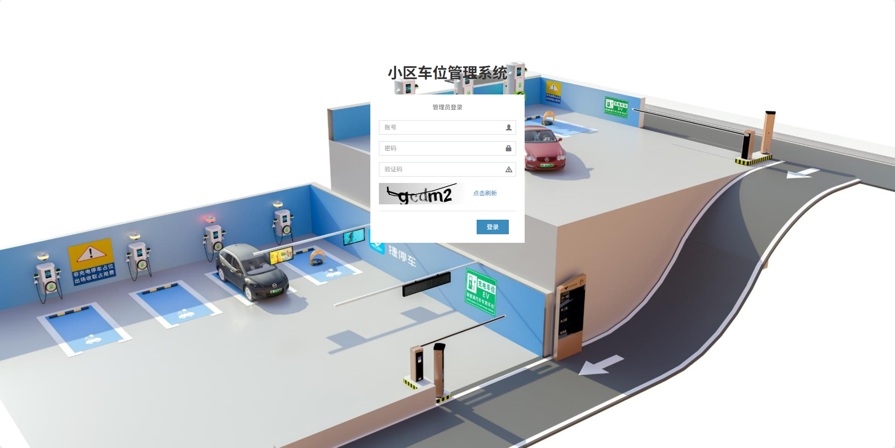
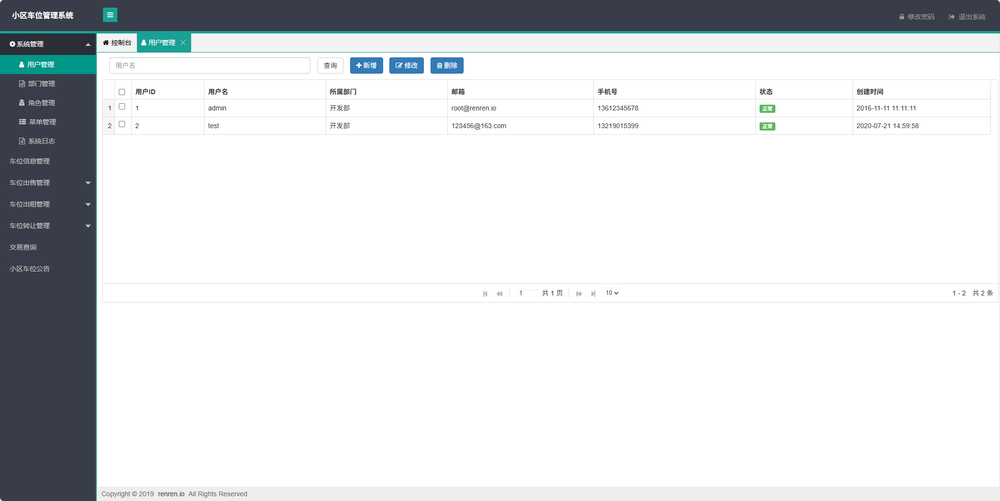
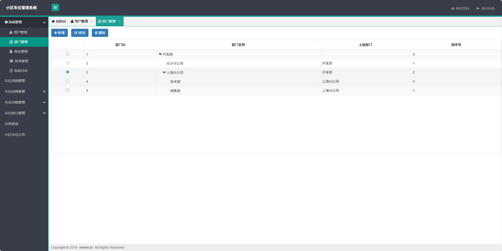
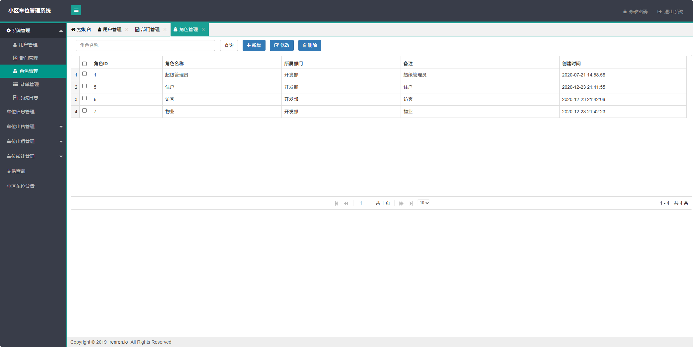
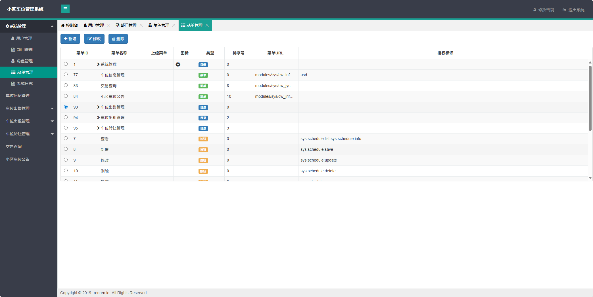
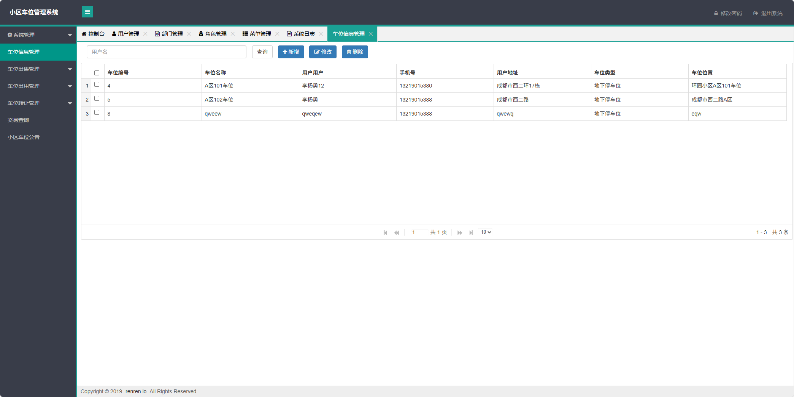
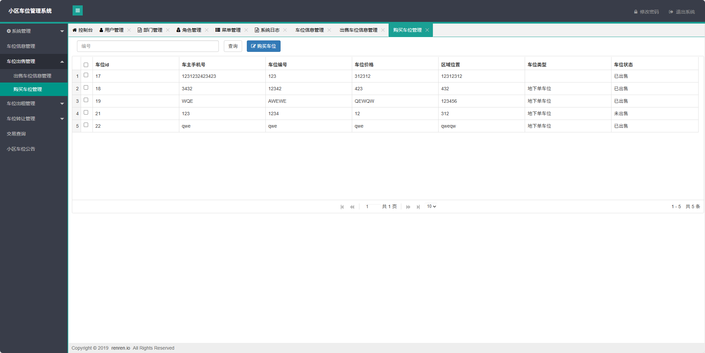
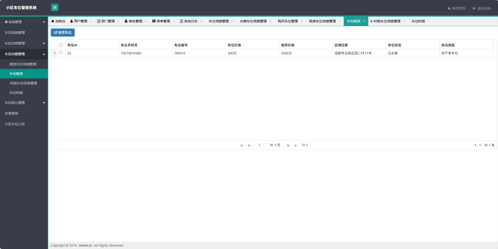
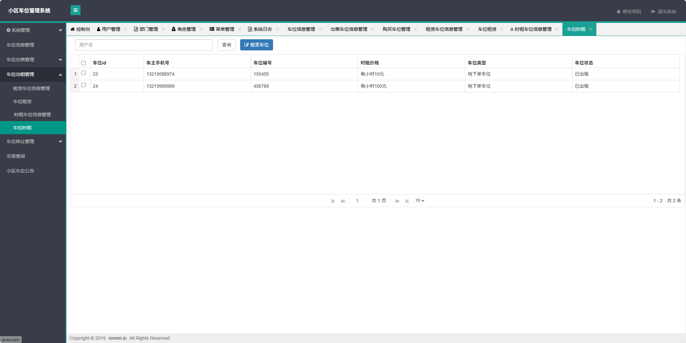
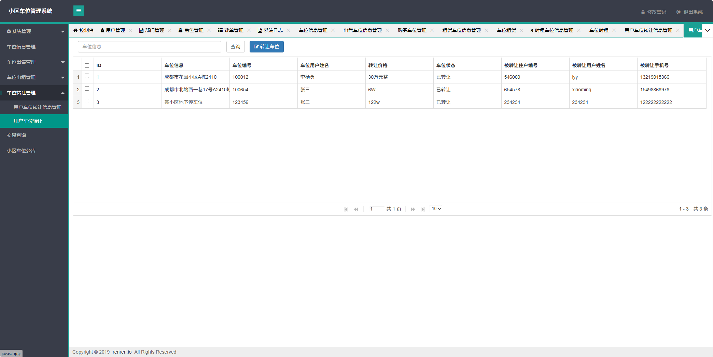
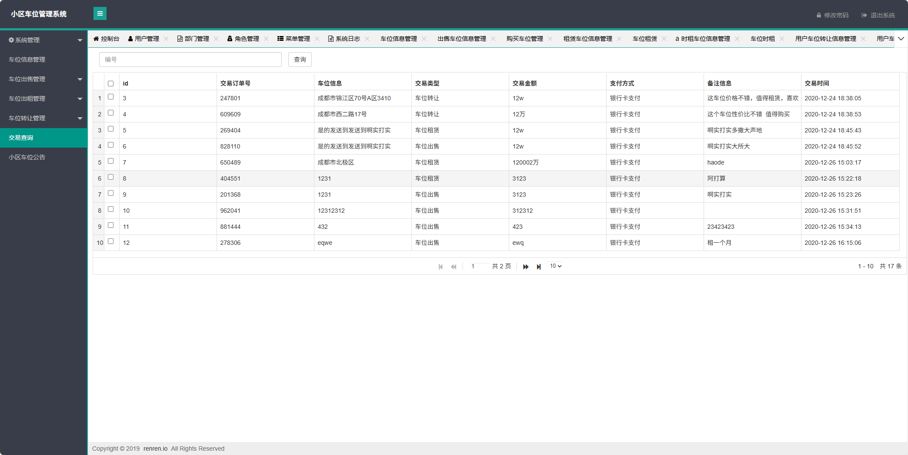
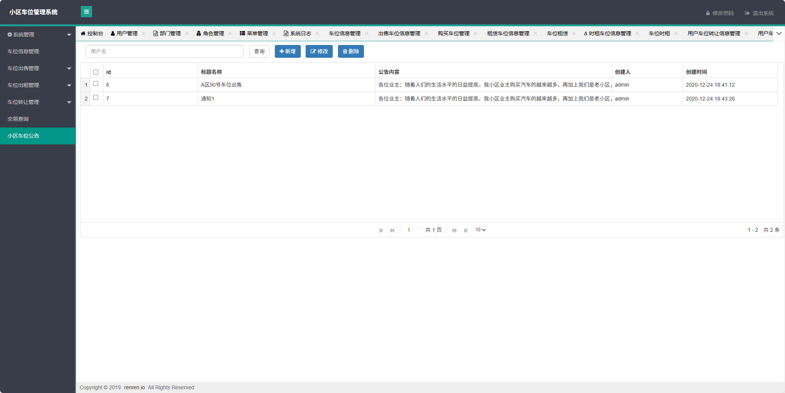
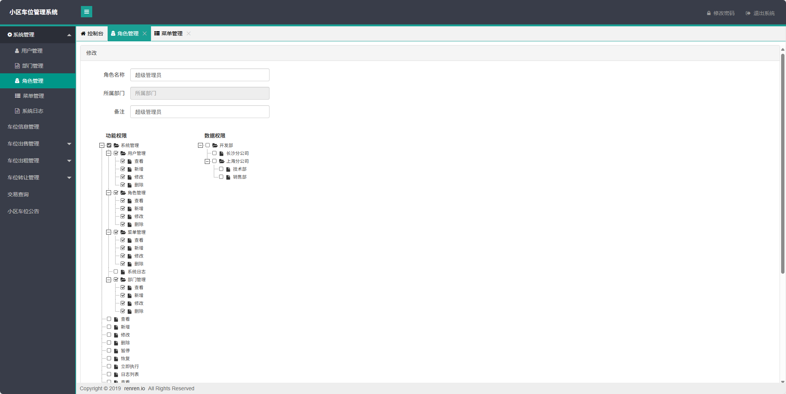

### 环境需求(可免费提供)
- idea/eclipse、jdk-1.8、maven-3.8.6、mysql、node.js等

## 有项目修改、安装调试需求 请联系以下

## 获取资源扫☝☝☝

